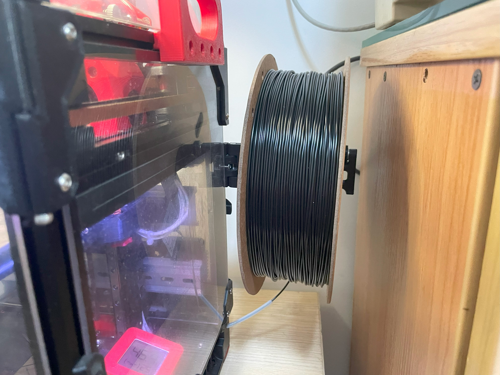
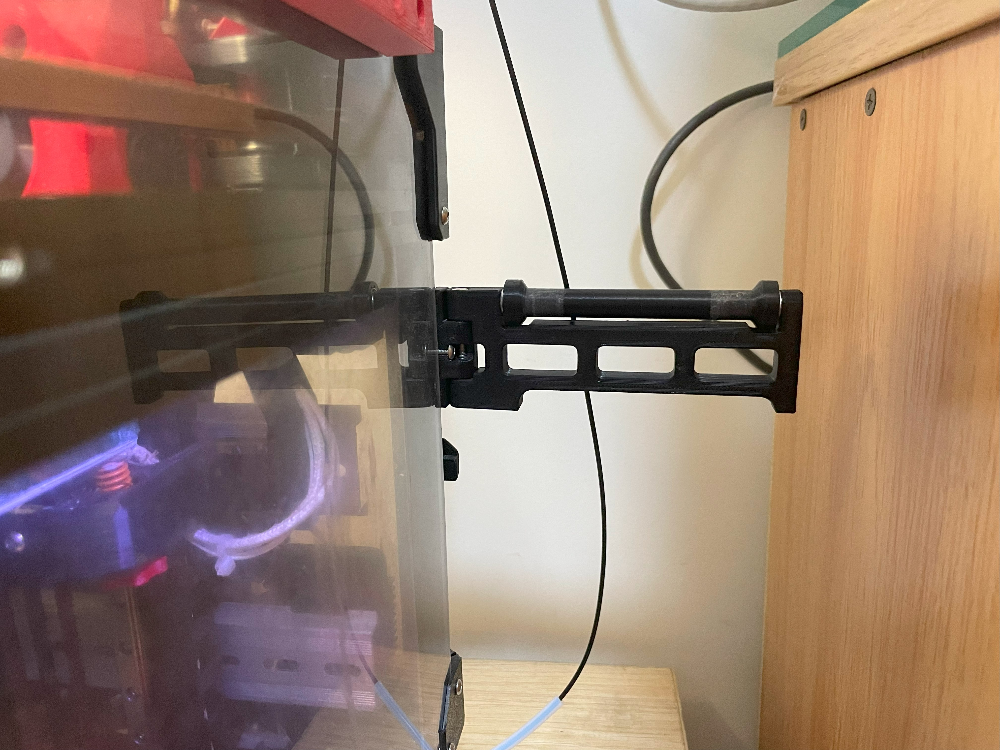
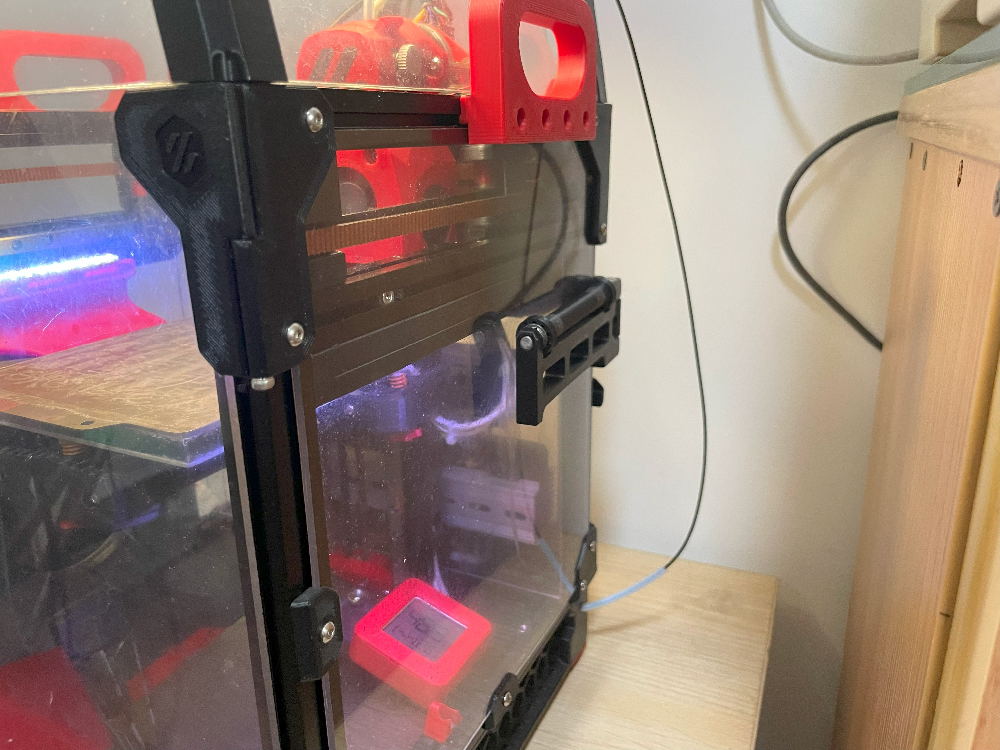

# Foldable_Spool_Holder_With_Roller [中文说明待更新](./Readme_CN.MD)

### This project originated from [Voron 0.1 Foldable Spool Holder](https://www.printables.com/model/311233-voron-01-foldable-spool-holder)

## Objectives

#### The objectives for this project are:

 - Makes the Spool roll more smoothly, especially the environmentally friendly (cardboard) spool.
 - Foldable, reducing the overall dimension of printer for easy storing / traveling.
   
### compatibility
   
 - Made to support Voron V0/V2, however should be able to support printer with 1515 or 2020.(did not verify on V2)
 - Compatible with any acrylic panel thickness less than 3 mm.

## Overall

### Picture

### Video
Nope

 
### [3D](./3D)
Nope

## Bill of Materials (BOM)
|NO.	|Category	|Part Name	|Qty	|Remark
|--|--|--|--|--|
|1	|Motion	|Shaft 5x100mm  |X1	|
|2	|Motion	|MR115ZZ	|x2 |5x11x4mm |
|3	|Motion	|Spacer_5x7x1|x2 |	
|4	|Fasteners	|M3x35 SHCS	|X1 ||
|5.1	|Fasteners	|M3x10 BHCS	|X1	|V0|
|5.2	|Fasteners	|M5x10 SHCS	|X1 |V2|
